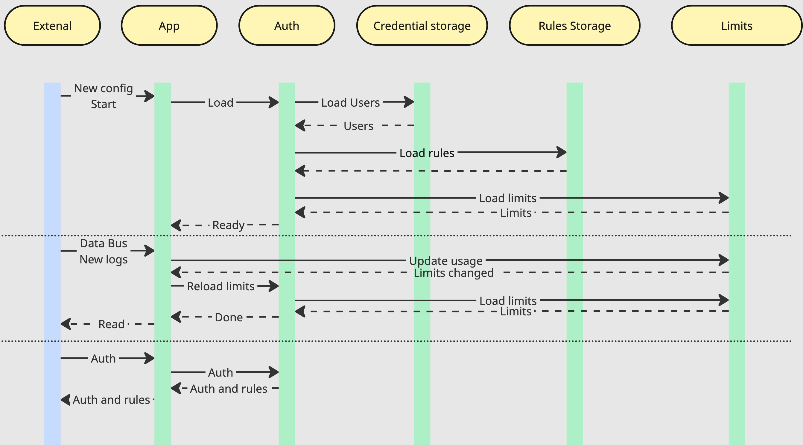

### Архитектура сервиса авторизации

## Общий взгляд

Сервис состоит из go приложения и базы данных пользователей.
Работа с сервисом из административной панели тривиальна и необходимые для этого эндпоинты рассмотрены не будут.

Сиквенс диаграмма показывающая старт сервиса, учёт потребления и запрос из гейтвея выглядит следующим образом:



## Описание работы

При запуске приложения оно стягивает в оперативную память всех пользователей, правила для них и ограничения на использование АПИ. Это сделано так для максимально быстрого ответа на запросы авторизации. С точки зрения затрат памяти можно оценить следующим образом:
1. У 90% компаний < 200 партнёрств
2. Количество методов АПИ для партнёров в 90% случаев < 500
3. Количество различных элементов данных для преобразования (скрытие или шифрование) < 200, т.к. большим количеством уже невозможно управлять

Итого: количество правил < 20 миллионов, вес правила < 200B, а значит будет затрачено менее 5ГБ оперативной памяти

При изменении правил, лимитов или пользователей через Админ панель, происходит также их изменение в кеше.

Приложение слушает шину данных, через которую проходят логи и при появлении новых - пересчитывает лимиты. Если оставшийся лимит запросов изменился - приложение перезагрузит актуальные остатки в кеш.

Дополнительно на регулярной основе (частота настраивается из админ панели) лимиты перезагружаются, тк мог произойти сброс (не отражено в сиквенс диаграмме).

## Модели данных

### User

```protobuf
message User {
    int32 user = 1;
    string authFunc = 2; // функция авторизации
    bytes authFuncData = 3; // данные по которым должна происходить сверка
}
```

### Rules
Используется как словарь модификаций над данными для каждого пользователя

```protobuf
message Rules {
    map<int32, UserRules> userRules = 1; // Ключ - пользователь
}

message UserRules {
    map<string, UserMethodRules> userMethodRules = 1; // Ключ - метод
}

message UserMethodRules {
    map<string, string> rule = 1; // Ключ - маска пути до поля данных, значение - скрытие или тип шифрования
    // Иерархия правил будет закрыта на уровне панели, так что правила применяются непосредственно к узлам в момент сериализации.
}

```


### Limits
Структура лимита выглядит следующим образом
```protobuf
message Limit {
    int32 user = 1; // Пользователь
    string method = 2; // Метод который ограничиваем (или любой)
    string type = 3; // Час, день, месяц и т.д.
    int32 count = 4; // Количество запросов в выбранный период
}
```

Для использования в рамках проверки авторизации система упрощает структуру до словаря по пользователю:

```protobuf
message Limit {
    map<int, User> user = 1; // Ключ - пользователь
}

message User {
    int32 balance = 1; // Общий остаток запросов или -1, если не задан
    map<string, int32> methods = 2; // Остаток запросов по методам или -1, если доступ к методу запрещён
}
```

### Запрос на авторизацию

```protobuf
message AuthRequest {
    bytes authData = 1;
    string authType = 2;
    string method = 3;
}

message AuthResponse {
    int32 code = 1; // а-ля HTTP код. Всё ок, нехватило лимита, нет доступа или проблемы с аутентификацией
    UserRules rules = 2;
}
```

### Проверка лицензии

Лицензия представляет собой данные про ограничения системы (количество партнёров, время действия) подписанные приватным ключом. При старте и затем регулярно приложение проверяет подпись и актуальность условий лицензии.