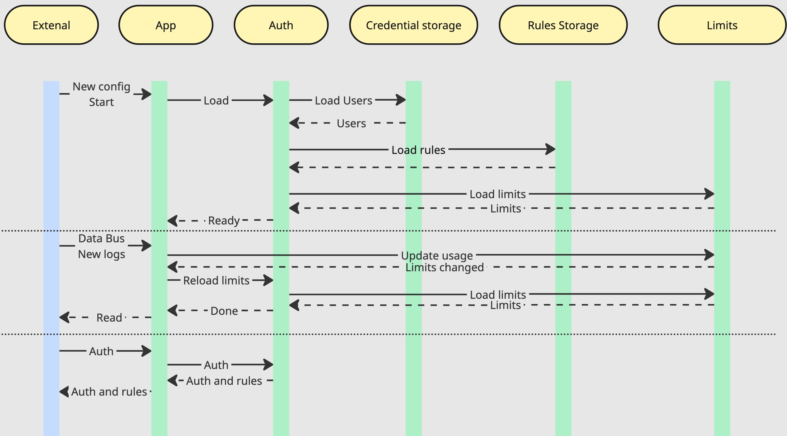

### Архитектура сервиса авторизации

> Диаграмма ниже относится к исходному замыслу (см. ниже) и не отражает текущую реализацию — актуальную схему см. в тексте.



## Текущая реализация

Сервис авторизации (`src/services/auth`) — отдельный Go-процесс (свой `go.mod`, порт 8081) со своей БД PostgreSQL (`gateway_auth`). Он отвечает **только за аутентификацию пользователей админ-панели** (логин/сессия/SSO). Авторизация запросов партнёров к Gateway In/Out (проверка Bearer-токена потребителя, применение field rules) выполняется не здесь, а напрямую в гейтвее (`src/backend`) по таблицам `consumers`/`rules`/`routes` в основной БД `gateway` — отдельного высоконагруженного auth-узла, держащего все правила в памяти, в системе нет.

### Поток запроса

1. Пользователь логинится через `POST /auth/login` (или OAuth/LDAP-флоу) — сервис проверяет пароль (bcrypt, провайдер `LocalProvider`) либо делегирует проверку внешнему провайдеру.
2. При успехе сервис выпускает RS256 JWT (claims `sub`, `iss=gateway-docs-auth`, TTL 8 часов) и кладёт его в cookie `gw_session`.
3. Gateway (`backend/auth.go`) один раз при старте забирает публичный ключ с `GET /.well-known/jwks.json` и дальше валидирует JWT **локально**, без обращения к auth-сервису на каждый запрос — этим достигается требование быстрого ответа из исходного замысла, но не через кеш правил в памяти, а через статическую проверку подписи токена.
4. `/auth/*` (включая `/auth/me`, `/auth/logout`) проксируется гейтвеем на auth-сервис как есть.

### Провайдеры аутентификации (`AuthProvider`)

- **Local** — bcrypt-хеши в таблице `admin_users`, заводятся из env `ADMIN_USERS=user:pass,...` при старте (`seedUsers`).
- **OAuth 2.0** — authorization code flow (`OAUTH_CLIENT_ID/SECRET/AUTH_URL/TOKEN_URL/REDIRECT_URL`, опционально `OAUTH_USERINFO_URL`/`OAUTH_SCOPES`/`OAUTH_PROVIDER_NAME`); имя пользователя резолвится из userinfo-эндпоинта либо (без проверки подписи, только для отображения) из payload id_token.
- **LDAP** — включается через `LDAP_HOST`: бинд сервисным аккаунтом → поиск по `LDAP_USER_FILTER` → ребинд под найденным DN с паролем пользователя → имя берётся из `LDAP_USER_ATTR`.

### Модели данных

```sql
admin_users (id, username, password_hash, provider)
oauth_states(state, expires_at)   -- CSRF-стейт OAuth-флоу, чистится фоновым job раз в 10 минут
```

### Чего нет относительно исходного замысла

- Нет protobuf-моделей `User`/`Rules`/`Limits`/`AuthRequest` и нет отдельного высоконагруженного эндпоинта авторизации партнёрских запросов — эту роль выполняет сам гейтвей.
- Нет проверки лицензии при старте/периодически.
- Нет учёта лимитов в реальном времени по логам и нет шины данных, которую слушал бы auth-сервис. Поле `routes.rate_limit` существует в схеме гейтвея, но сейчас только хранится и не применяется ни одним обработчиком.
- Правила маскирования/хеширования живут не в auth-сервисе, а в таблице `rules` основной БД гейтвея и применяются гейтвеем синхронно на каждый запрос (см. [Gateway In](./gatewayIn.md)).

## Исходный замысел (историческая версия, не реализована)

Изначально предполагался отдельный высоконагруженный сервис авторизации, который при старте стягивает в память всех пользователей, все правила маскирования и все лимиты использования API, слушает шину логов для пересчёта остатков лимитов в реальном времени и периодически перезагружает лимиты из-за возможного внешнего сброса. Также предполагалась проверка подписанной лицензии (ограничения по числу партнёров и сроку действия) при старте и регулярно. Ниже — оценка памяти и модели данных из этого замысла, оставлены для истории:

Оценка памяти: при <200 партнёрств, <500 методов API и <200 типов полей на компанию — менее 20 млн правил по <200 байт, то есть <5 ГБ оперативной памяти.

```protobuf
message User {
    int32 user = 1;
    string authFunc = 2; // функция авторизации
    bytes authFuncData = 3; // данные по которым должна происходить сверка
}

message Rules {
    map<int32, UserRules> userRules = 1; // Ключ - пользователь
}
message UserRules {
    map<string, UserMethodRules> userMethodRules = 1; // Ключ - метод
}
message UserMethodRules {
    map<string, string> rule = 1; // Ключ - маска пути до поля данных, значение - скрытие или тип шифрования
}

message Limit {
    int32 user = 1;
    string method = 2;
    string type = 3; // Час, день, месяц и т.д.
    int32 count = 4;
}

message AuthRequest {
    bytes authData = 1;
    string authType = 2;
    string method = 3;
}
message AuthResponse {
    int32 code = 1;
    UserRules rules = 2;
}
```

Лицензия в этом замысле — данные об ограничениях системы, подписанные приватным ключом и проверяемые на старте и регулярно.
