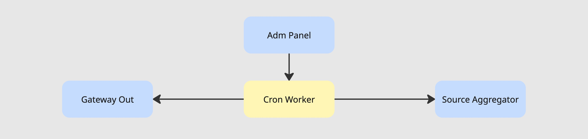

### Cron Worker

## Схема

## Принцип работы

Админ панель передаёт в крон воркер регулярные задачи.

При наступлении задачи воркер работает по следующему алгоритму:
1. Если надо идём в аггрегатор источников за данными по одному источнику (без фильтрации и аггрегации на первом этапе)
2. Передаём запрос через Gateway Out
3. Если есть потребность передаём ответ в аггрегатор источников, чтобы он положил его куда требуется
4. Отчитываемся в лог о проделанной работе со статусами