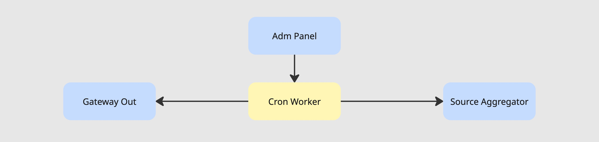

### Cron Worker

> Диаграмма ниже относится к исходному замыслу (отдельный сервис + аггрегатор источников) и не отражает текущую реализацию.

## Текущая реализация

Cron Worker — не отдельный сервис, а часть процесса гейтвея (`src/backend/cron.go`), встроена через `robfig/cron/v3`. Job'ы хранятся в таблице `cron_jobs` и планируются in-memory при старте; CRUD и ручной запуск — через `/api/cron*`.

Алгоритм выполнения job'а (`executeJob`):

1. Воркер сам делает HTTP-запрос (`method`/`url`/`headers`/`body` из job'а) — без отдельного шага "идём в аггрегатор источников", аггрегатора в системе нет.
2. Если у job'а задан `outbound_route_id` — ответ форвардится через соответствующий [Gateway Out](./gatewayIn.md) route (с применением IP-allow-листов, инъекции заголовков и field rules, как для обычного исходящего трафика). Иначе, если задан `forward_url` — ответ форвардится туда напрямую.
3. Статус (`last_run`/`last_status`/`last_error`) обновляется на самом job'е, и параллельно пишется полноценная запись в `cron_runs` (история прогонов, доступна через `GET /api/cron/{id}/runs`).
4. Ручной запуск без ожидания расписания — `POST /api/cron/{id}/run`.

## Чего нет относительно исходного замысла

- Нет отдельного "аггрегатора источников" — воркер обращается к источнику напрямую по URL, заданному в job'е.
- Нет отдельного процесса/контейнера для cron — это часть gateway-бинаря, масштабируется и деплоится с ним вместе.
