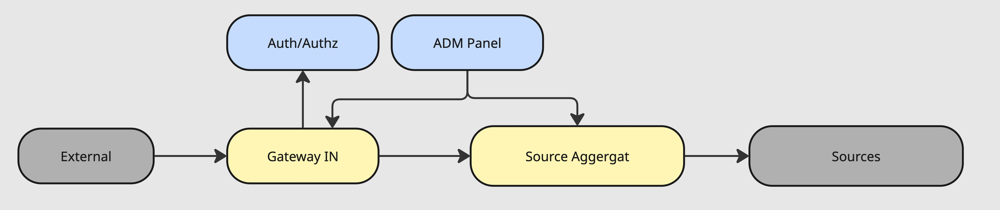
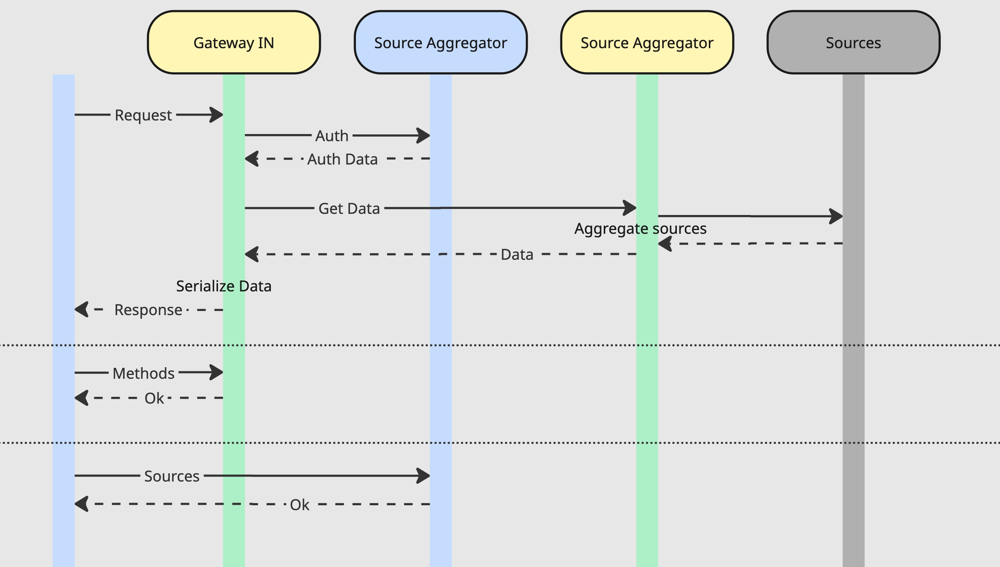

### Gateway In

> Диаграммы ниже относятся к исходному замыслу (гейтвей + отдельный аггрегатор источников) и не отражают текущую реализацию.

## Текущая реализация

Gateway In — не два сервиса, а часть одного процесса гейтвея (`src/backend/main.go: handleGateway`), той же, что обслуживает Gateway Out (`gateway_out.go`) и Gateway Peer (`gateway_peer.go`). Отдельного "аггрегатора источников" в системе нет — у каждого route один upstream (`routes.target`), без конфигурации множественных источников, схем подключения к ним или политики ретраев.

### Поток запроса (`/gw/*`)

1. Определяется вызывающая сторона (`resolveConsumer`):
   - либо по доверенному подписанному запросу от другого инстанса гейтвея (Gateway Peer, см. [Gateway Peer](./gatewayPeer.md)) — доверенный peer получает доступ ко **всем** routes;
   - либо по Bearer-токену (`consumers.token`). Пустой токен отвергается явно (`401`) — иначе он совпал бы с консьюмером, у которого `token=''`, то есть открывал бы анонимный вход.
2. По `path` + `method` ищется `route` (`findRoute`). Из всех подходящих по префиксу выбирается route с **самым длинным** `path` (`/a/b` выигрывает у `/a`), метод сравнивается без учёта регистра, `*` матчит любой. Порядок важен не только для маршрутизации: выбранный route определяет, какие правила маскирования применятся, поэтому он не должен зависеть от физического порядка строк в таблице.
3. Проверяется, что `route_ids` потребителя включает найденный route — иначе `403`.
4. Если у route задан `rate_limit` (> 0) — проверяется in-memory счётчик запросов на route за текущее часовое окно (`rateLimitExceeded`); при превышении — `429`, без обращения к upstream. Счётчик живёт в памяти процесса: не переживает рестарт и не общий между репликами (при нескольких инстансах фактический лимит умножается на их число).
5. Запрос форвардится на `route.target`, вызов ограничен таймаутом `gatewayUpstreamTimeout` (30с) на весь цикл обработки. Заголовок `Authorization` потребителя до upstream не доходит — он удаляется.
6. Ответ прогоняется через field rules (см. ниже).
7. Каждый запрос асинхронно логируется в ClickHouse (см. [Log Collector](./log.md)).

Схема ответа отдельно в админ-панели не задаётся — поля адресуются прямо по пути в `rules.field`, без отдельного шага сериализации по заранее сконфигурированной схеме.

### Field rules и маскирование

Правила берутся из таблицы `rules`, scoped по паре `consumer_id` + `route_id`. Действия — по dotted-path до поля, включая вложенные пути и массивы (`applyRules`/`applyRule`):

| Действие | Что делает |
|---|---|
| `hide` / `remove` | удаляет поле из ответа |
| `mask` | заменяет значение на `***` |
| `hash` | заменяет значение на HMAC-SHA256 от него (hex, 32 символа) |

`hash` — это **HMAC-SHA256 с солью** `GATEWAY_HASH_SALT`, а не голый sha256: несолёный хеш телефона, ИНН или email перебирается по словарю за секунды, то есть «хеширование» не скрывало бы значение. Соль общая для инстанса и обязана быть постоянной между рестартами — при её смене все ранее выданные партнёру псевдонимы полей изменятся, и сквозная аналитика по ним развалится. Если `GATEWAY_HASH_SALT` не задан, гейтвей поднимается со случайной эфемерной солью и пишет об этом в лог (годится только для дева).

### Маскирование fail-closed

Ключевая гарантия продукта: **если для консьюмера на этом route настроены field rules, он физически не может получить ответ, который гейтвей не смог замаскировать.** Раньше поведение было fail-open — неразобранное тело проходило насквозь сырым, то есть ровно те данные, ради сокрытия которых правило и заводилось, утекали при первом же нестандартном ответе upstream.

Сейчас (`ModifyResponse` в `handleGateway`) при непустом наборе правил ответ отдаётся партнёру, только если тело удалось разобрать и отфильтровать. Во всех остальных случаях — `502 upstream response cannot be masked` и запись в лог, а не сырое тело:

- `Content-Type` не содержит `application/json`;
- тело сжато (`Content-Encoding` не пустой и не `identity`);
- тело больше `maxProxyBodyBytes` (8 MiB) — лимит буферизации в память, без него один большой ответ upstream ронял бы процесс (контейнер живёт с `mem_limit 96m`);
- тело не парсится как JSON или результат не сериализуется обратно.

Чтобы это не срабатывало на каждом ответе, upstream'у при наличии правил принудительно отправляется `Accept-Encoding: identity` — сжатое тело замаскировать нельзя.

Если правил для пары консьюмер+route нет, тело не буферизуется и не разбирается вовсе — оно стримится как есть.

### Ограничение модели доверия: доверенный peer обходит маскирование

**Доверенный peer получает все routes в незамаскированном виде.** Это следствие того, как устроен `resolveConsumer`: peer-запрос резолвится в синтетического консьюмера `Consumer{ID: "gateway-peer"}` со списком всех route ID, а правила ищутся запросом `WHERE consumer_id=$1 AND route_id=$2`. Строк с `consumer_id='gateway-peer'` в таблице `rules` нет и завести их через админ-панель нельзя (это не настоящий консьюмер), поэтому набор активных правил для peer всегда пуст — а значит, маскирование, включая fail-closed-проверку выше, к нему не применяется.

Практический смысл: пометка peer'а `trusted=true` в `/api/peers` — это решение «отдавать этому гейтвею всё, что у нас есть, без фильтрации полей», а не «пустить его как ещё одного консьюмера». Доверять peer'у стоит только на симметричном канале, где фильтрацию по потребителям выполняет уже принимающая сторона.

Код на этот счёт пока не менялся; ограничение известное и описано здесь честно, чтобы его не приняли за баг конфигурации. Чтобы отдавать peer'у ограниченный набор данных, нужно выдать той стороне обычного консьюмера с Bearer-токеном и правилами — а не помечать её доверенным peer'ом.

## Чего нет относительно исходного замысла

- Нет отдельного сервиса-аггрегатора источников и связанной с ним конфигурации (строки подключения к БД, схемы API источника, политика ретраев).
- Нет ретраев к upstream — ни на роут, ни на источник.
- Нет аутентификации консьюмера по сертификату или Basic Auth — только Bearer-токен (`consumers.token`).
