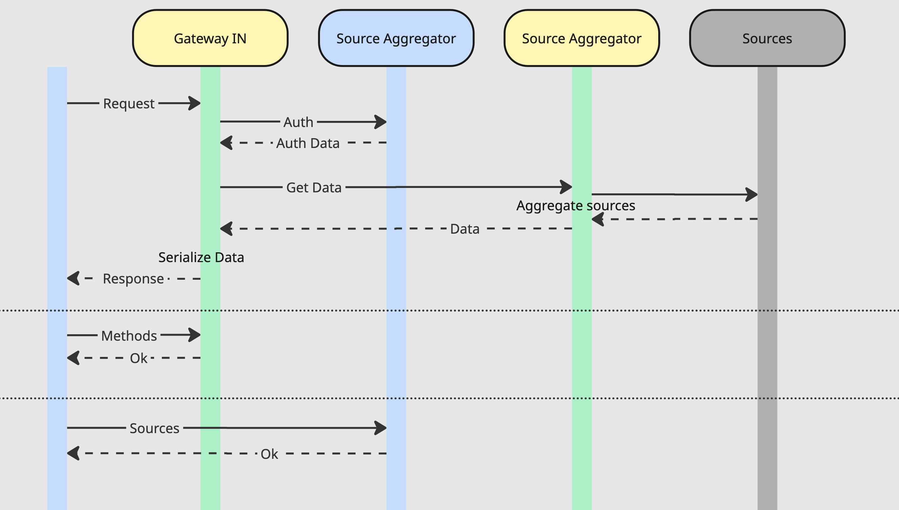

### Gateway In

## Схема

## Описание работы

Gateway In состоит из двух сервисов - собственно гейтвея и аггрегатора источников.

Сиквенс диаграмма:

Сервисы настраиваются через админ панель. Аггрегатор источников получает от панели список источников данных и способ получения данных из них. Например ссылку подключения к базе или схему АПИ сервиса, политику ретраев и т.п.

Гейтвей со своей стороны получает список доступных снаружи методов и схемы ответа с источниками данных.

При запросе снаружи мы проверяем авторизацию и получаем список правил для скрытия или хеширования данных, после чего отправляем запрос в аггрегатор за данными. Когда на гейтвей приходят данные мы их сериализуем согласно схеме ответа полученной из админ панели, а также модифицируем указанным способом (скрываем или хешируем).
