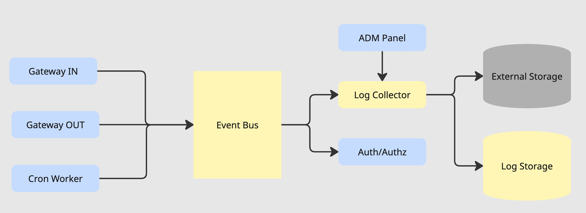

### Log Collector

> Диаграмма ниже относится к исходному замыслу (шина данных + отдельный лог-коллектор) и не отражает текущую реализацию.

## Текущая реализация

Нет шины данных и нет отдельного сервиса-коллектора — логирование встроено в сам процесс гейтвея (`src/backend/clickhouse.go`) и пишет напрямую в ClickHouse.

1. Каждый обработанный запрос (Gateway In и Gateway Out) кладёт запись (`ts, consumer_id, route_id, method, path, status, duration_ms`) в буферизованный канал `logCh` (емкость 1000) — `pushLog` не блокирует обработку запроса, при переполнении буфера новые записи отбрасываются.
2. Фоновая горутина `flushLogs` батчит вставки в ClickHouse каждые 500мс либо каждые 100 записей (что раньше).
3. Таблица `log_entries` (`MergeTree`, `ORDER BY (ts, consumer_id)`, `PARTITION BY toYYYYMM(ts)`, `TTL ts + INTERVAL 30 DAY`) — партиционирование по месяцу из коробки ClickHouse, старые записи ClickHouse удаляет сам.
4. `GET /api/logs` и `GET /api/stats` читают ClickHouse напрямую — аналитика считается прямыми запросами, без предварительной агрегации. Отдаются последние 500 записей (`ORDER BY ts DESC LIMIT 500`).

### Фильтры `GET /api/logs`

- `path` — подстрока пути (`LIKE %...%`).
- `status` — класс либо точный код:
  - одна цифра 1–9 — класс статуса: `status=4` вернёт все 4xx (`intDiv(status, 100) = 4`);
  - три цифры 100–599 — конкретный код: `status=404` вернёт только 404 (`status = 404`).

  Всё остальное (`abc`, `42`, `600`, `099`) отвергается с `400 status must be a class digit 1-9 or a full code 100-599`.

### Что попадает в запись

Заполненность полей зависит от того, кто писал лог:

| Поле | Gateway In (`/gw/*`) | Gateway Out (`/gw-out/{id}`, cron) |
|---|---|---|
| `consumer_id` | id консьюмера (для peer-запроса — `gateway-peer`) | инициатор: `ip:<адрес>` (HTTP-вызов) или `cron:<job_id>` (cron-форвард) |
| `route_id` | id из `routes` | id из `outbound_routes` |
| `method` | метод запроса | метод исходящего запроса к партнёру (из конфига роута) |
| `path` | путь запроса | `target_url` роута |
| `status`, `duration_ms` | да | да |

Исходящий трафик атрибутирован к инициатору: по записи Gateway Out видно, какой outbound-роут сработал, с каким результатом и кто инициировал отправку — HTTP-вызов (с какого IP, достоверность как у `source_ip_masks`: `X-Real-IP` от собственного reverse proxy) или конкретная cron-джоба. Отказы по allow-листам (`403`) логируются с той же атрибуцией.

Запросы, не прошедшие аутентификацию на Gateway In (`401`), логируются без `consumer_id` и `route_id` — консьюмер к этому моменту ещё не определён.

## Чего нет относительно исходного замысла

- Нет настраиваемой через админ-панель ротации и выгрузки логов — retention фиксирован (30 дней, TTL на `log_entries`), выгрузки во внешний сторадж нет.
- Нет интеграции с собственным storage логов клиента — ClickHouse, изначально рассматривавшийся как решение "для первой версии", остался единственным хранилищем логов.
- При переполнении буфера (1000 необработанных записей) новые логи теряются — нет гарантии сохранности на этот случай.
