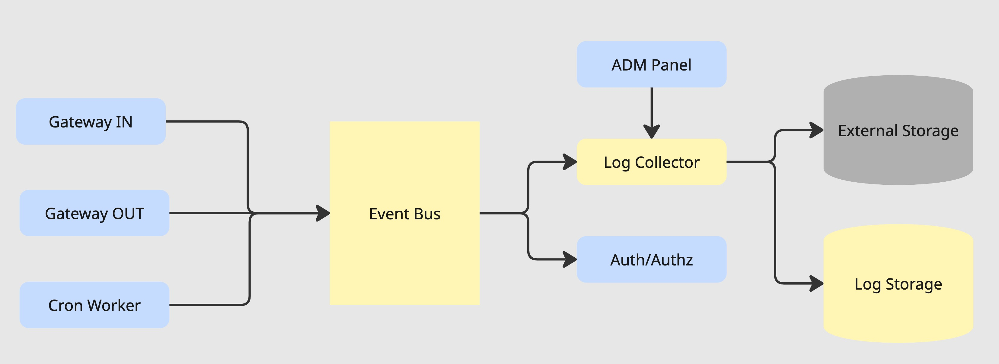

### Log Collector

## Схема

## Принцип работы

Гейтвеи и крон воркер пишут в шину логи:

1. Запросы со статусом ответа
2. Запросы к источникам со статусом их ответа
3. Возникшие проблемы

Лог коллектор вынимает логи из шины и складирует их.
Он отвечает за сохранность, ротацию, выгрузку и доступ к логам из админ панели.

Ротация и выгрузки настраиваются через админ панель.

Так как в Админке будут доступны аналитические запросы, Log Storage должен быть оптимизирован под:

1. Атомарная быстрая запись небольших строк (<3KB)
2. Аналитические запросы

Для первой версии подойдёт ClickHouse, но с развитием системы стоит идти в сторону обязательной интеграции со стораджем логов клиента, что позволит облегчить предоставляемые гарантии сохранности логов, а также правила ротации. Собственный сторадж останется для перерасчёта лимитов и аналитики в админ панели.