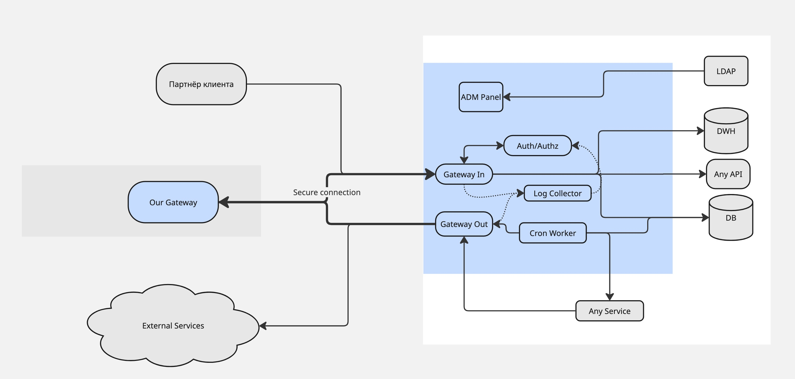

# API Gateway

## Решаемая проблема
Многие крупные компании на сегодняшний день активно занимаются цифровизацией своего бизнеса.
Как следствие этого процесса - обмен цифровыми данными посредством API или предоставлением доступа к части DWH - это новая сторона партнёрских соглашений.

*Исследование McKinsey "Цифровизация бизнеса в России" (2022) указывает, что около 25% всех корпоративных соглашений включают элементы обмена данными.*

При этом в мире также существует тренд на ужесточение наказаний за утечку данных (см GDPR или аналоги в России). Как следствие - компании стремятся обезопасить свои данные закрывая к ним доступ.

Исходя из этих двух тенденций - безопасный обмен данными становится всё сложнее, при этом остаётся критически важным для развития бизнеса.

## Верхнеуровневый обзор решения

Создать ПО, которое будет устанавливаться в контур партнёра. Данное ПО будет состоять из агента и админ панели.

Админ панель будет интегрирована с системой авторизации заказчика, она позволит контролировать какие данные из внутренних источников можно передавать партнёру с возможностью конфигурации различных наборов данных для разных партнёров из интерфейса. Дополнительно админ панель позволит настроить агреггацию источников, фильтрацию и хеширование части данных. Также будет доступна возможность настроить получение данных от партнёра через эту панель. Отдельно будут доступны логи для аудита и вся необходимая аналитика.

Агент будет выполнять роль двустороннего API Gateway, который в случае наличия со стороны партнёра такого-же агента будет устанавливать безопасное соединение.

Представляемое решение позволит облегчить интеграцию, значительно сократив необходимый инженерный ресурс. Также часть данных может быть "захеширована на лету", что позволит избегать утечек. Как один из примеров использования - возможность построить сквозную аналитику по хешированным данным (например сквозную воронку продаж), что может положительно влиять на развитие бизнеса.

## Рассматриваемые альтернативы
Как альтернативы созданию своего ПО рассматривалась доработка существующих открытых решений (APISIX, Kong, Tyc, Krakend)

APISIX требует значительных переработок для реализации необходимой информации

Kong не имеет открытого исходного кода самого гейтвея

Tyc обладает лицензией MPL, что делает проблематичным разработку софта на базе этого кода

Krakend является полноценным конкурентом предлагаемому решению и часть из его наработок может быть использована как основа для нашего решения, больше фокусирующемся на обмене данными между партнёрами.

## Обзор архитектуры

### Общий взгляд

Важной особенностью Архитектуры является то, что для каждого роута АПИ потребители будут получать только тот набор данных, который доступен именно им. Напримре для роута отдающего список пользователей одни потребители могут получать только id и логин, а другие дополнительно получат ФИО

### ADM Panel

Административная панель. Состоит из интерфейса для конфигурации всех входящих и исходящих запросов. Также имеет доступ к LDAP серверу клиента для получения пользователей и их ролей.

Имеет возможности:

1. Добавления внешних роутов, источников данных, и связок и модификаций внутренних данных с доступным снаружи АПИ. Также доступна настройка рейт лимитов и ретраев на отдельные роуты или источники.
2. Добавление потребителей АПИ, ограничений на использование каждым потребителем и возможных способов аутентификации (например сертификат, Basic Auth или токен).
3. Добавление ограничений на исходящий трафик. Как на источники исходящего трафика так и на удалённые ресурсы.
4. Просматривать аудитные логи и аналитику, анализируя потребление трафика
5. Настраивать регулярную выгрузку или отправку данных партнёру

При изменении произведённом в админ панели производится переконфигурация всех систем затронутых изменением

Является набором сервисов (UI, база данных и система управления состоянием остальных элементов системы)

### Gateway out

Проксирует трафик наружу с учётом заданных ограничений. В случае обнаружения на удалённой стороне аналогичного ПО - устанавливает защищённый канал.

### Gateway in

Конфигурируется через ADM панель. Отвечает за ограничения нагрузки на источники, ограничения на использование роута, аггрегацию, модификацию и передачу данных.

### Cron Worker

Сервис исполняющий регулярные задачи по выгрузке/загрузке данных. Конфигурируется через ADM панель.

### Log Collector

Собирает и агрегирует логи с Gateway out и Gateway in. Делает это в фоне, что создаёт лаг для аналитики, но не нагружает черезмерно гейтвеи и не добавляет задержки на каждый запрос. Так же сервис предоставляет данные для аналитики.

### Auth/Authz

Отвечает за аутентификацию и авторизацию всех запросов. Дополнительно проверяет лицензию на использование системы и ограничения (например количество запросов для партнёра в какой-то период времени). Исходя из последнего требования - использует аггрегат от логов для риалтайм расчёта лимитов.

Т.к. в теории является самым нагруженным узлом системы должен все правила держать в памяти. 

Трейдофф который принят в этом сервисе - возможно переиспользование АПИ партнёром, тк аггрегация логов для проверки лимитов - имеет отложенный характер (исходя из того как будет организован лог коллектор).

Подробнее про его устройство можно прочитать в отдельной [статье](./auth.md).