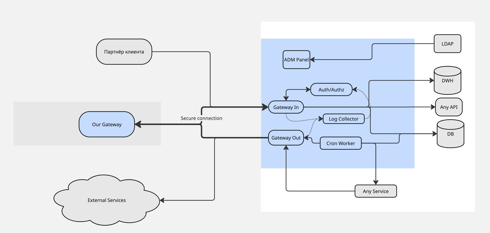

# API Gateway

## Решаемая проблема
Многие крупные компании на сегодняшний день активно занимаются цифровизацией своего бизнеса.
Как следствие этого процесса - обмен цифровыми данными посредством API или предоставлением доступа к части DWH - это новая сторона партнёрских соглашений.

*Исследование McKinsey "Цифровизация бизнеса в России" (2022) указывает, что около 25% всех корпоративных соглашений включают элементы обмена данными.*

При этом в мире также существует тренд на ужесточение наказаний за утечку данных (см GDPR или аналоги в России). Как следствие - компании стремятся обезопасить свои данные закрывая к ним доступ.

Исходя из этих двух тенденций - безопасный обмен данными становится всё сложнее, при этом остаётся критически важным для развития бизнеса.

## Верхнеуровневый обзор решения

Создать ПО, которое будет устанавливаться в контур партнёра. Данное ПО будет состоять из агента и админ панели.

Админ панель будет интегрирована с системой авторизации заказчика, она позволит контролировать какие данные из внутренних источников можно передавать партнёру с возможностью конфигурации различных наборов данных для разных партнёров из интерфейса. Дополнительно админ панель позволит настроить агреггацию источников, фильтрацию и хеширование части данных. Также будет доступна возможность настроить получение данных от партнёра через эту панель. Отдельно будут доступны логи для аудита и вся необходимая аналитика.

Агент будет выполнять роль двустороннего API Gateway, который в случае наличия со стороны партнёра такого-же агента будет устанавливать безопасное соединение.

Представляемое решение позволит облегчить интеграцию, значительно сократив необходимый инженерный ресурс. Также часть данных может быть "захеширована на лету", что позволит избегать утечек. Как один из примеров использования - возможность построить сквозную аналитику по хешированным данным (например сквозную воронку продаж), что может положительно влиять на развитие бизнеса.

## Рассматриваемые альтернативы
Как альтернативы созданию своего ПО рассматривалась доработка существующих открытых решений (APISIX, Kong, Tyc, Krakend)

APISIX требует значительных переработок для реализации необходимой информации

Kong не имеет открытого исходного кода самого гейтвея

Tyc обладает лицензией MPL, что делает проблематичным разработку софта на базе этого кода

Krakend является полноценным конкурентом предлагаемому решению и часть из его наработок может быть использована как основа для нашего решения, больше фокусирующемся на обмене данными между партнёрами.

## Обзор архитектуры

### Общий взгляд

Важной особенностью Архитектуры является то, что для каждого роута АПИ потребители будут получать только тот набор данных, который доступен именно им. Напримре для роута отдающего список пользователей одни потребители могут получать только id и логин, а другие дополнительно получат ФИО

> Текущая реализация (см. `CLAUDE.md` в корне репозитория) объединяет ADM Panel, Gateway out, Gateway in, Cron Worker и Log Collector в **один процесс** (`src/backend`). Отдельным сервисом вынесена только аутентификация (`src/services/auth`) — и то лишь логин пользователей админ-панели, а не авторизация партнёрских запросов. Ниже описан исходный замысел по сервисам; расхождения с тем, что реализовано, указаны в конце каждого раздела и подробнее — в `auth.md`/`cron.md`/`gatewayIn.md`/`log.md`.

### ADM Panel

Административная панель. Состоит из интерфейса для конфигурации всех входящих и исходящих запросов.

Имеет возможности:

1. Добавления внешних роутов, источников данных, и связок и модификаций внутренних данных с доступным снаружи АПИ. Также доступна настройка рейт лимитов и ретраев на отдельные роуты или источники.
2. Добавление потребителей АПИ, ограничений на использование каждым потребителем и возможных способов аутентификации (например сертификат, Basic Auth или токен).
3. Добавление ограничений на исходящий трафик. Как на источники исходящего трафика так и на удалённые ресурсы.
4. Просматривать аудитные логи и аналитику, анализируя потребление трафика
5. Настраивать регулярную выгрузку или отправку данных партнёру

При изменении произведённом в админ панели производится переконфигурация всех систем затронутых изменением

*Реализовано:* админ-панель — статический frontend, ходящий в REST API того же процесса, что обслуживает Gateway in/out (нет отдельной БД или сервиса управления состоянием — общая БД `gateway`). Доступ к LDAP клиента есть, но только как провайдер логина для самой панели (`src/services/auth`, см. `auth.md`) — ролей партнёров оттуда панель не тянет. Рейт-лимиты на роуты настраиваются в интерфейсе и **применяются** гейтвеем: при превышении `rate_limit` за текущее часовое окно запрос получает `429` без обращения к источнику (счётчик in-memory, на инстанс — см. `gatewayIn.md`). **Ретраи** настраиваются на роут (`retry_count` 0–5: dial-ошибки — для любых методов, прочие транспортные ошибки и 502/503/504 — только для идемпотентных) и на cron-джобу (транспортная ошибка или ≥500) — см. `gatewayIn.md`/`cron.md`. **Квоты на потребителя** применяются: отдельный лимит req/час на пару потребитель+роут (`consumer_quotas`) поверх рейт-лимита роута. Аутентификация потребителя — все три обещанных способа: Bearer-токен, Basic Auth (`consumer_id:token`) и клиентский сертификат (mTLS на reverse proxy, сопоставление по SHA-1 fingerprint — детали и модель доверия в `gatewayIn.md`). Отдельно существует доверенный peer-гейтвей (`gatewayPeer.md`) — не аутентификация потребителя, а доступ ко всем роутам; поля при этом можно маскировать per-peer правилами (`consumer_id = peer:<id>`), без правил отдаётся всё целиком.

*Не реализовано из перечисленного выше:*

- **Квоты по календарным периодам** (месяц/день) — окно квоты фиксировано: час, как у рейт-лимита роута.
- **Ретраи на источник отдельно от роута** — источник у роута один, политика ретраев задаётся на роут.

### Gateway out

Проксирует трафик наружу с учётом заданных ограничений (allow-листы по IP источника/назначения, инъекция заголовков, field rules с whitelist-семантикой). В случае обнаружения на удалённой стороне аналогичного ПО (по `.well-known/gateway`) — устанавливает защищённый канал (подписанные RS256-JWT запросы). Подробнее в [статье](./gatewayOut.md); про peer-канал — в [отдельной статье](./gatewayPeer.md).

### Gateway in

Отвечает за модификацию и передачу данных по правилам, заданным в ADM панели.

Ключевая гарантия: маскирование работает **fail-closed** — если для потребителя на этом роуте заданы правила, а ответ источника невозможно разобрать и замаскировать (не JSON, сжат, больше 8 MiB, битый), потребитель получает `502`, а **не** сырое тело. Иначе первый же нестандартный ответ источника выносил бы наружу ровно те данные, ради сокрытия которых правило и заводилось.

Подробнее в [статье](./gatewayIn.md), включая расхождения с замыслом (нет аггрегации источников и ограничения нагрузки на источники) и модель доверия peer-гейтвея: доверенный peer видит все роуты, но поля можно маскировать per-peer правилами; без заведённых правил ответ уходит незамаскированным.

### Cron Worker

Исполняет регулярные задачи по выгрузке/загрузке данных, конфигурируется через ADM панель. Подробнее в [статье](./cron.md), включая расхождения с замыслом (встроен в Gateway-процесс, нет отдельного аггрегатора источников).

### Log Collector

Собирает логи с Gateway out и Gateway in в фоне (асинхронно, без блокировки запроса) и предоставляет данные для аналитики через REST API.

Подробнее в [статье](./log.md), включая расхождения с замыслом (нет шины данных и настраиваемой ротации/выгрузки).

### Auth/Authz

Отвечает за аутентификацию пользователей административной панели (логин, сессия, SSO через OAuth/LDAP). Авторизация партнёрских запросов к Gateway in/out (проверка токена потребителя, применение field rules) выполняется не здесь, а в самом гейтвее.

Подробнее про его устройство, включая расхождения с исходным замыслом (нет проверки лицензии, нет общего для всех правил кеша в памяти, нет риалтайм-расчёта лимитов по логам), можно прочитать в отдельной [статье](./auth.md).